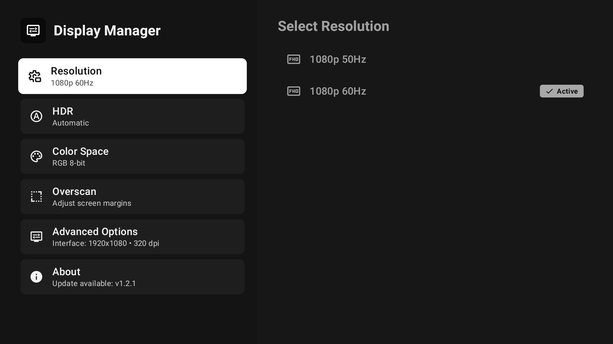

# Allwinner Display Manager



A Jetpack Compose application to configure and manage display settings on devices powered by Allwinner SoCs.

## Requirements

- **Root access** is required to execute hardware display commands.
- Android 10+ (API 29+).

## Building

The project uses Gradle with the Android SDK.

```bash
# Build debug APK
./gradlew assembleDebug

# Build release APK
./gradlew assembleRelease
```
